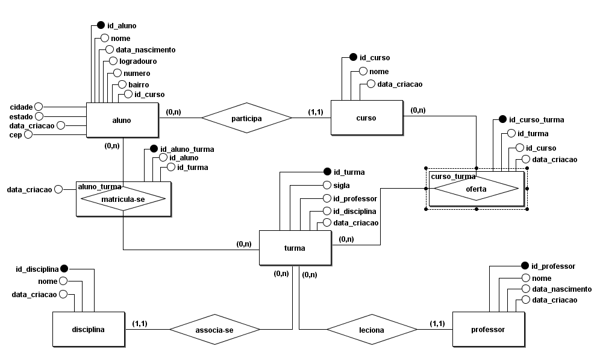

## Modelo Entidade Relacionamento

## Endereço de Produção:
- http://schoolsystemflex.herokuapp.com/

## Sobre o Sistema Escolar Flex
 Sistema de Gerencimento de Instituição Escolar. Possui as Seguintes Funcionalidades.
 - CRUD de Curso
 - CRUD de Professor
 - CRUD de Disciplina
 - CRUD de Aluno 

## Configuração
 1. Instalar o WAMP.
 2. Clonar o repositório do projeto e instalar na pasta **wamp/wwww**.  
 3. Rodar as migrações `php artisan migrate`. Certifique-se se as seguintes tabelas foram criadas: _Curso_, _Professor_, _Disciplina_ e _Aluno_.

## Casos de Teste
1. Ao tentar excluir um **Curso** que está relacionado com algum **Aluno**, o usuário deverá ser alertado com uma notifição de erro.
2. Ao tentar *Salvar* e *Editar* **Curso**, **Professor**, **Disciplina** e **Aluno** deixando o formulário vázio, o usuário deverá ser alertado com uma notifição.     
